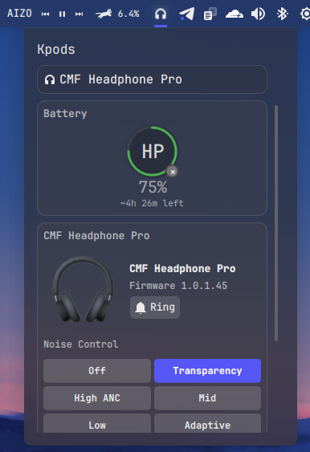

# Kpods

[](https://www.gnu.org/licenses/gpl-3.0)
[](https://kde.org/plasma-desktop/)
[](https://github.com/rshero/kpods/actions/workflows/ci.yml)
[](https://www.rust-lang.org/)

Native **AirPods®** integration for **KDE Plasma 6** powered by a modern, low-latency Rust backend.

Kpods is a fork of kAirPods with support for more devices. Currently supports Nothing devices.

<p align="center">
  
</p>

---

## ✨ Features

- 🔋 **Real-time battery monitoring** for AirPods, AirPods Max, case, and individual earbuds
- 🔇 **Noise control** switching between ANC, Transparency, and Off modes
- 👂 **Ear detection** status and control
- ⏯️ **Auto play/pause** - Automatically pauses media when AirPods are removed and resumes when reinserted
- 🎨 **Native Plasma integration** with theme-aware panel widget
- ⚡ **Zero-lag Bluetooth L2CAP** communication for instant updates
- 🔧 **System-wide D-Bus service** architecture (no root required)

---

## 🚀 Quick Install

### One-liner install (recommended)

```bash
curl -fsSL https://raw.githubusercontent.com/rshero/kpods/master/scripts/get.sh | bash

# With options:
curl -fsSL https://raw.githubusercontent.com/rshero/kpods/master/scripts/get.sh | bash -s -- --verbose --debug
```

### Manual install

```bash
# Clone the repository
git clone https://github.com/rshero/kpods.git
cd kpods

# Run the automated installer
./scripts/install.sh
```

The installer will:

- ✅ Check all prerequisites and dependencies
- ✅ Add you to the `bluetooth` group (if it exists)
- ✅ Build the Rust service in release mode
- ✅ Install all components system-wide
- ✅ Start the service via systemd
- ✅ Guide you through adding the widget

---

## 📋 Prerequisites

| Component          | Minimum Version | Notes                                              |
| ------------------ | --------------- | -------------------------------------------------- |
| **KDE Plasma**     | 6.0             | Required for widget support                        |
| **Rust toolchain** | 1.88+           | [Install Rust](https://rustup.rs/)                 |
| **BlueZ**          | 5.50+           | Bluetooth stack (package: `bluez` or `bluez-libs`) |
| **Linux Kernel**   | 5.10+           | L2CAP socket support                               |
| **systemd**        | 247+            | User services support                              |
| **D-Bus**          | 1.12+           | IPC communication                                  |

### 📦 Development Packages

<details>
<summary><b>Debian/Ubuntu</b></summary>

```bash
sudo apt install build-essential pkg-config libdbus-1-dev libbluetooth-dev
```

</details>

<details>
<summary><b>Fedora</b></summary>

```bash
sudo dnf install gcc pkg-config dbus-devel bluez-libs-devel
```

</details>

<details>
<summary><b>Arch Linux</b></summary>

```bash
sudo pacman -S base-devel pkgconf dbus bluez-libs
```

</details>

---

## 🎯 Getting Started

### 1️⃣ **Pair Your AirPods**

First, pair your AirPods through KDE System Settings → Bluetooth

### 2️⃣ **Install Kpods**

```bash
./scripts/install.sh
```

### 3️⃣ **Add the Widget**

- Right-click on your Plasma panel
- Select "Add Widgets"
- Search for "Kpods"
- Drag to panel

### 4️⃣ **Enjoy!**

Click the widget to see battery levels and control your AirPods

---

## 🛠️ Troubleshooting

<details>
<summary><b>Service won't start / No devices detected</b></summary>

1. **Check bluetooth group** (installer handles this automatically):

   ```bash
   groups | grep bluetooth
   ```

2. **Check service logs**:

   ```bash
   systemctl --user status kairpodsd
   journalctl --user -u kairpodsd -f
   ```

3. **Ensure AirPods are paired** via KDE Bluetooth settings first
</details>

<details>
<summary><b>Permission denied errors</b></summary>

- The installer automatically adds you to the bluetooth group
- If you still have issues, try: `sudo setcap 'cap_net_raw,cap_net_admin+eip' $(command -v kairpodsd)`
</details>

<details>
<summary><b>Widget not showing up</b></summary>

- Restart plasmashell: `systemctl --user restart plasma-plasmashell`
- Or simply log out and back in
</details>

<details>
<summary><b>Battery not showing / Debug logging</b></summary>

If your AirPods connect but battery information is missing, enable debug logging to help diagnose the issue:

#### Method 1: Running manually with debug output

1. **Stop the service**:
   ```bash
   systemctl --user stop kairpodsd.service
   ```

2. **Start in debug mode**:
   ```bash
   # Shows general debug info and all Bluetooth packets
   RUST_LOG=kairpodsd=debug,kairpodsd::bluetooth::l2cap=trace kairpodsd
   
   # Or use the full path if needed
   RUST_LOG=kairpodsd=debug,kairpodsd::bluetooth::l2cap=trace /usr/bin/kairpodsd
   ```

3. **Reproduce the issue**:
   - Put your AirPods in your ears (or just open the case)
   - Wait about 30 seconds for the handshake and first battery message
   - Copy the terminal output (you can redact MAC addresses like AA:BB:CC:DD:EE:FF)

#### Method 2: Using systemd with debug config

1. **Create config file**:
   ```bash
   mkdir -p ~/.config/kairpods
   echo 'log_filter = "debug"' > ~/.config/kairpods/config.toml
   ```

2. **Restart the service**:
   ```bash
   systemctl --user restart kairpodsd.service
   ```

3. **View logs**:
   ```bash
   journalctl --user -u kairpodsd.service -b --no-pager
   ```

The debug output will show:
- Connection handshake details
- All Bluetooth packet exchanges
- Battery update messages (or lack thereof)
- Any parsing errors or protocol issues

Common causes for missing battery info:
- BlueZ experimental features not enabled (installer handles this automatically)
- Enhanced Retransmission Mode (ERTM) disabled
- Outdated BlueZ version (need ≥ 5.50)
</details>

---

## 🏗️ Architecture

```
                             ┌─────────────────────────┐
                             │      Plasma Widget      │
                             │  (Kirigami / QML UI)    │
                             └───────────▲─────────────┘
                                         │  D-Bus IPC
                                         │
┌───────────────────────┐   manages   ┌──▼────────────────┐
│   plasmashell (GUI)   │◀────────────│   kairpodsd       │
│  + panel & widgets    │  systemd-u  │  (Rust service)   │
└───────────────────────┘             └──┬────────────────┘
                                         │  Bluetooth L2CAP
                                         │
                                   ┌─────▼───────┐
                                   │  AirPods    │
                                   └─────────────┘

```

- **Backend**: High-performance Rust service (`kairpodsd`) with direct L2CAP access
- **Frontend**: QML Plasmoid with Kirigami components
- **IPC**: D-Bus interface at `org.kairpods.manager`

---

## 🔌 D-Bus API

For developers and power users:

```bash
# List connected devices
busctl --user call org.kairpods /org/kairpods/manager \
    org.kairpods.manager GetDevices

# Control noise mode
busctl --user call org.kairpods /org/kairpods/manager \
    org.kairpods.manager SendCommand ssa{sv} "AA:BB:CC:DD:EE:FF" "set_noise_mode" 1 "value" s "anc"
```

<details>
<summary><b>Full API Reference</b></summary>

### Methods

- `GetDevices() → s` - Returns JSON array of all connected AirPods
- `GetDevice(address: s) → s` - Returns JSON state of specific device
- `SendCommand(address: s, action: s, params: a{sv}) → b` - Send commands
- `ConnectDevice(address: s) → b` - Connect to AirPods
- `DisconnectDevice(address: s) → b` - Disconnect from AirPods

### Signals

- `BatteryUpdated(address: s, battery: s)` - Battery level changes
- `NoiseControlChanged(address: s, mode: s)` - Noise control changes
- `DeviceConnected(address: s)` - Connection events
- `DeviceDisconnected(address: s)` - Disconnection events
</details>

---

## 🗑️ Uninstalling

```bash
./scripts/install.sh --uninstall
```

Or with curl:

```bash
curl -fsSL https://raw.githubusercontent.com/rshero/kpods/master/scripts/get.sh | bash -s -- --uninstall
```

---

## 📄 License

This project is licensed under the **GNU General Public License v3.0** or later.  
See the [LICENSE](LICENSE) file for details.

---

## 🤝 Contributing

Contributions are welcome! Please feel free to submit a Pull Request.

For more details on manual installation, advanced configuration, or packaging for distributions, see [INSTALL.md](INSTALL.md).
